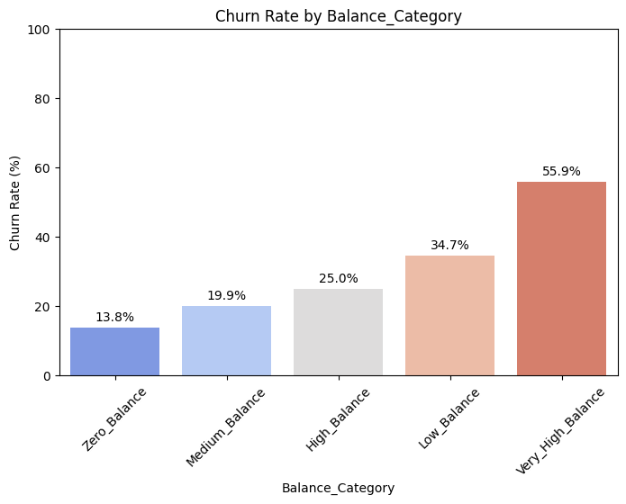
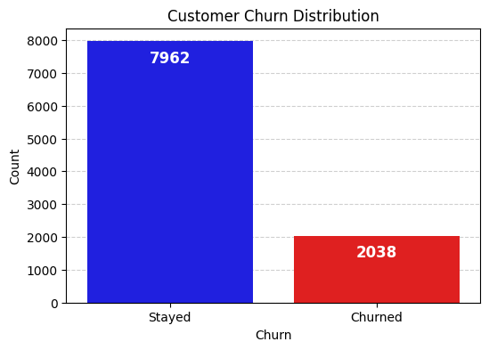

# Customer Churn Analysis - XYZ Bank

## Business Question
**"Which customers may leave the bank in the future and how can we reduce the risk of churn?"**

This project aims to understand the factors that contribute to customer churn at **XYZ Bank** and explore patterns within customer data to predict who may churn in the future. The goal is to assist the bank in identifying high-risk customers and providing recommendations to reduce churn. While prescriptive analytics will be introduced in the future, the current focus is on **descriptive analytics** to uncover insights from the data.

## Project Workflow

1. **Data Validation**  
   The first step involved checking the integrity of the dataset, ensuring there were no missing values, inconsistencies, or erroneous data that could affect the analysis.

2. **Data Cleaning**  
   The dataset was already clean and did not require any additional cleaning or data preprocessing.

3. **Exploratory Data Analysis (EDA)**  
   In this phase, various patterns in the dataset were explored. We examined the relationship between various features (such as age, balance, and active membership) and customer churn.

4. **Feature Engineering**  
   New categorical features were created based on continuous data such as age, tenure, and balance. These new features helped in grouping customers into meaningful segments for analysis.

5. **Data Insights and Hypothesis Testing**  
   Statistical tests, such as chi-square tests, were applied to test hypotheses about the relationships between various features and customer churn. This helped in identifying statistically significant factors influencing churn.

6. **Data Visualization**  
   We created visual representations of the churn rates across different categories (e.g., age groups, balance categories) to help better understand the patterns in the data.

     
   

## Key Findings

- Customers with higher balances exhibited a higher likelihood of churning — the higher the balance, the more likely the customer is to churn.
- Customers aged 45 - 65 years old are more likely to leave the bank.
- Customers with inactive accounts are more prone to leaving.

## Recommendations

Based on the findings, the following recommendations can be made:
1. **Target high-balance customers:**  
   Since customers with higher balances are more likely to churn, XYZ Bank should consider offering personalized financial services or incentives to retain these customers.
   
2. **Engage customers in the 45-65 age group:**  
   As this group is more prone to churn, targeted engagement through tailored communication or loyalty programs may help retain them.

3. **Activate dormant accounts:**  
   Since customers with inactive accounts are more likely to churn, XYZ Bank should consider strategies to re-engage inactive customers, such as offering new services or promotions.

4. **Customer Retention Programs:**  
   Implement retention strategies such as loyalty rewards or additional services for customers with medium to high balances or those in the 45-65 age range.

## Future Work

While the current focus is on descriptive analytics, the project will be extended to include prescriptive analytics in the future. This will involve building models to predict churn and developing strategies to reduce churn risk.

## Technologies Used

- Python
- Pandas
- Matplotlib
- Seaborn
- Scikit-learn (for future model building)
- Jupyter Notebook

## How to Run the Project

1. Clone this repository to your local machine:
    ```bash
    git clone https://github.com/runesu/Bank-Customer-Attrition-analysis.git
    ```
2. Install the required dependencies:
    ```bash
    pip install -r requirements.txt
    ```
3. Run the project:
    ```bash
    jupyter notebook
    ```

## Contributing

Feel free to open issues, fork the repository, and submit pull requests.
